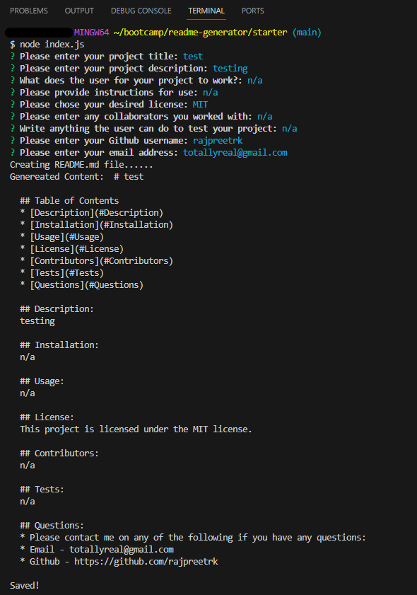

# README Generator

## Description
For this week's challenge, I was tasked to create a readme generator using javascript, inquirer and node.js. To help me achieve my final code, I started out by adding questions to the array provided by the starter files then attended a tutoring session for help to be pointed in the right direction. From there, I was able to use the resources provided by the tutor to help me complete the assignment and gain a better understanding of node.js and inquirer.

## Screenshot

## Usage
To use this application, please ensure that you are in the starter folder before running node index.js in the terminal.

## Credits:
I sued the following to help me reach my final code:
* Tutoring session

## Lisence
MIT Lisence
